# Fan "funfares-web-system-NewAE"
# Welcome to FunFares

------
##1. WEBSITE
###HOMEPAGE
In homepage, there are several travel Deals offering users to purchase. Besides, they can click the City to show details about Deals as well as book the Deals if the users have login.(the page will adjust layout when uers access different equipments.)
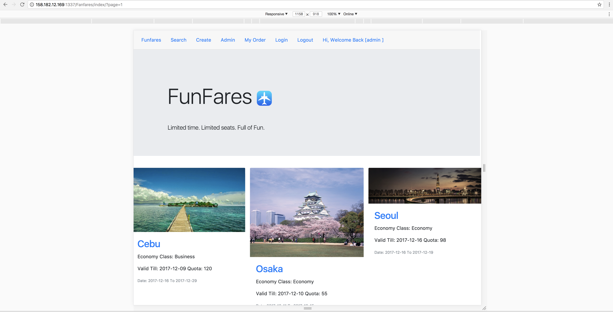
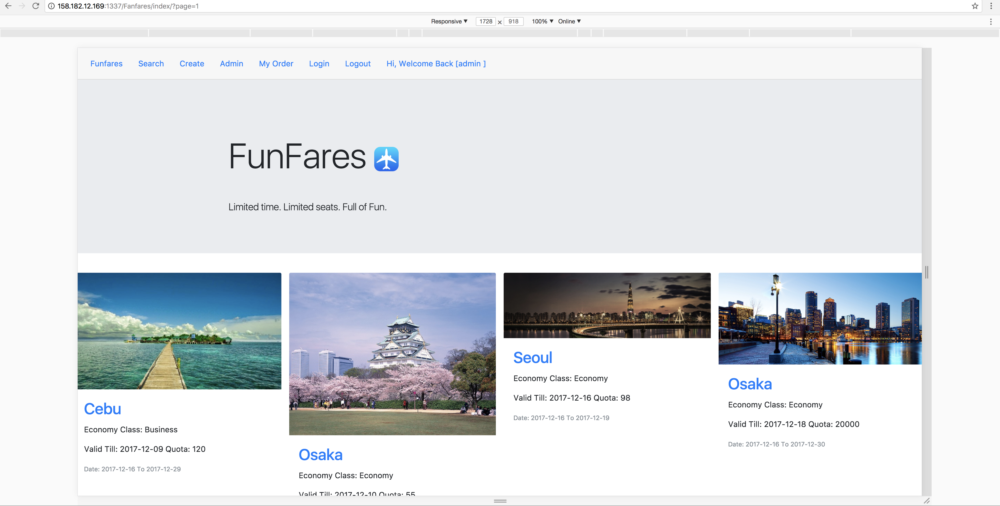
###SEARCH
In case of meeting the demand of convenience, the users may fill in some conditions in searching for the Deals they want to go. In this page, users can search out the Deals by date or range information.
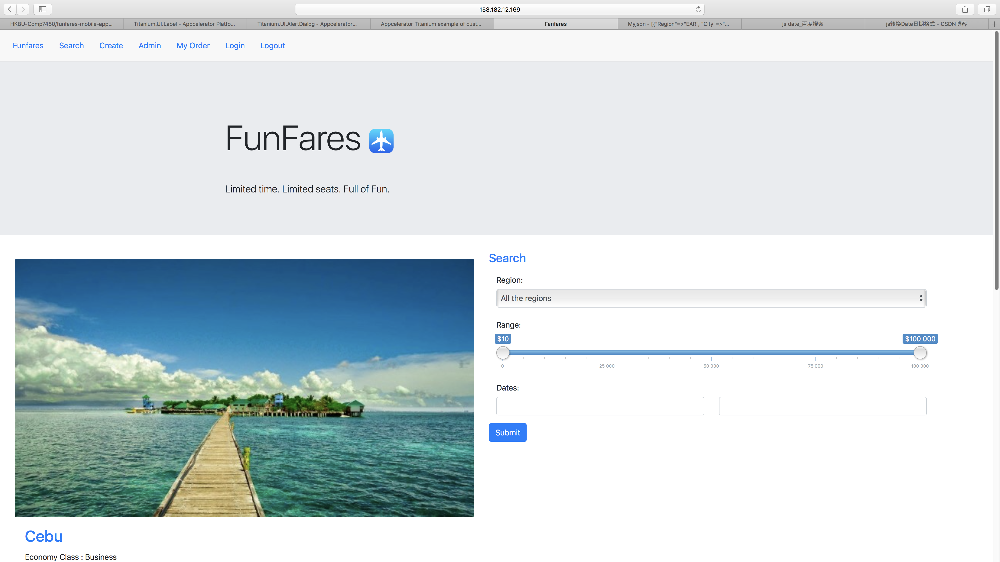
###CREATE
In this function, Admin Role can delete and update Deals in this page. In addtion, he can obtain a list which is about who bought this Deals.(This function is only for admin.)
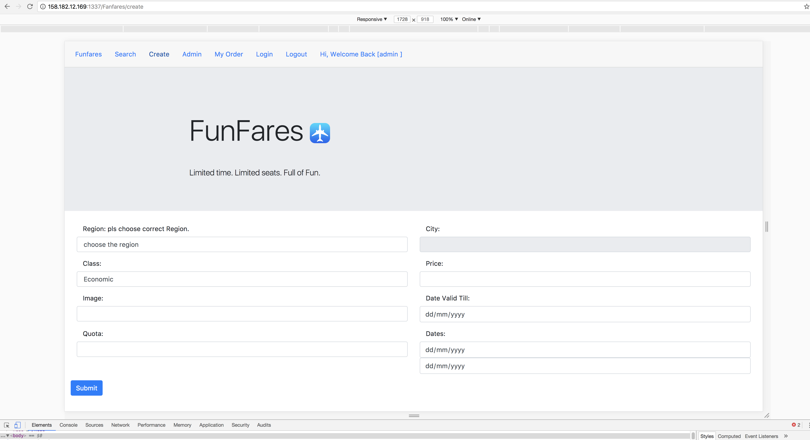
###ADMIN
At the same time, Admin Role can create a new Deals through enter essential information in this page.(This function is only for admin .)
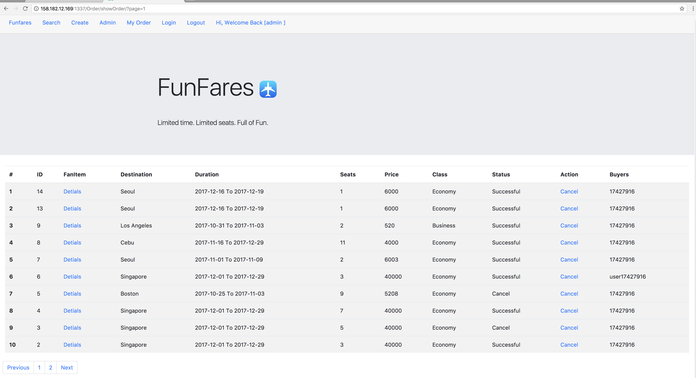
###FORBIDDEN
This page will display when users (user role) try to use CREATE and ADMIN page.
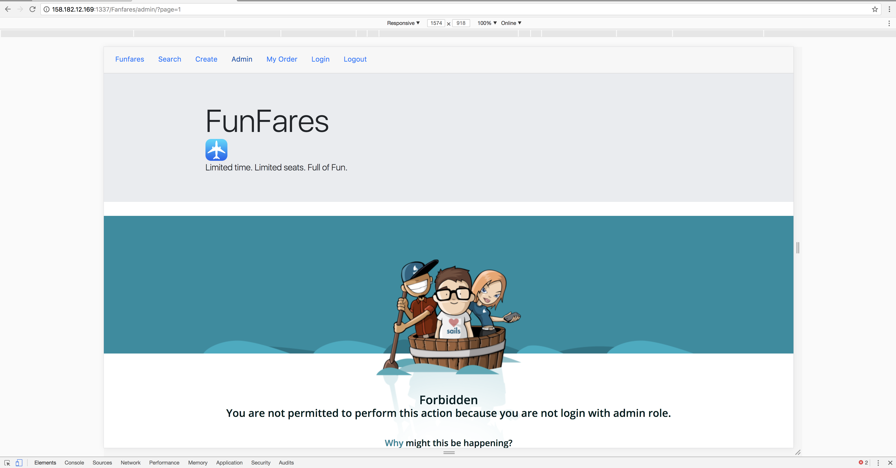
###MY ORDER
Users can get a list about what Deals they have bought in FanFares and they can also Cancel the Deals before the availiable period.
Admin also can see all the Deals in this system so that it can maintain the daily Deals.
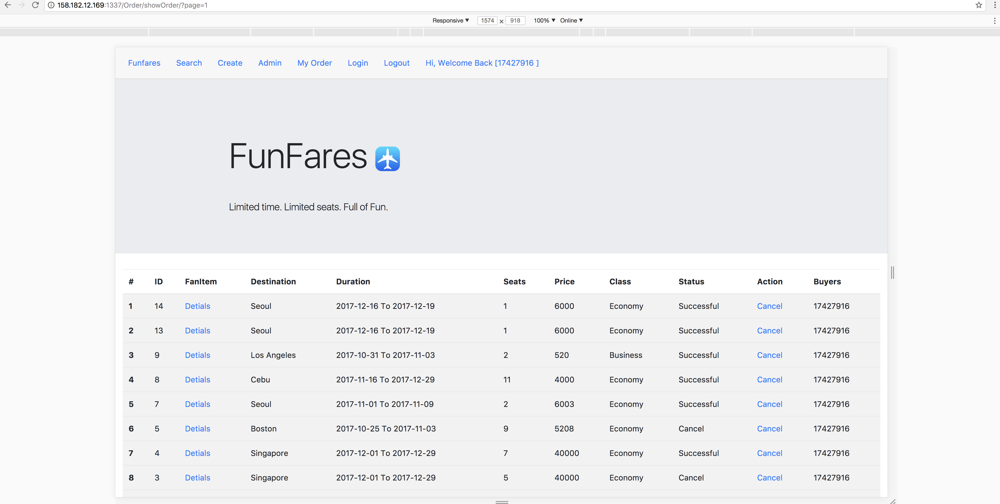

###LOGIN /LOGOUT
This is LOGIN or LOGOUT page, users and admin should log in firstly when they want to use some specific function.
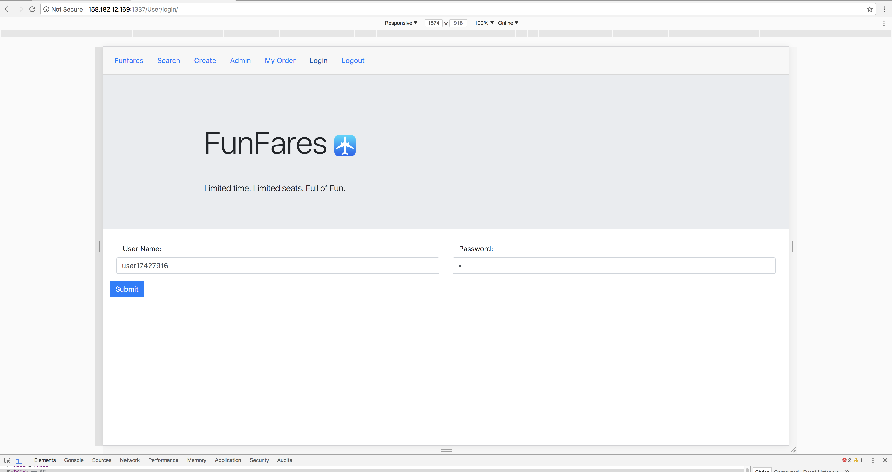

##2. APP
###HOMEPAGE
Users Or vistors can see Home pages from the Json from the web site and it can click the page to show the details as well as book the package for this deals if you have login the system.
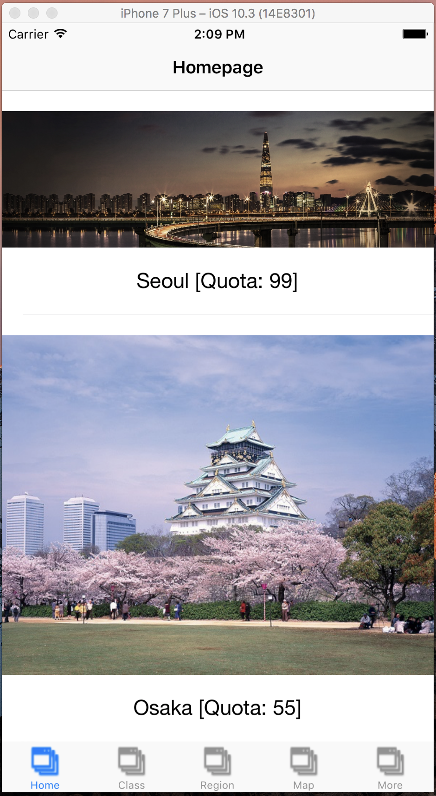
###DETAILS
The description as above.
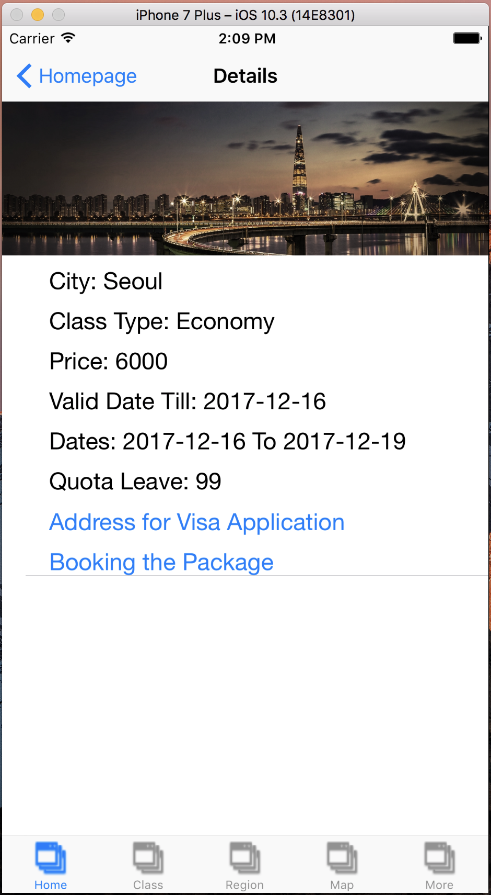
###LOGIN
The Users can log in the system to book any packages of Deals.
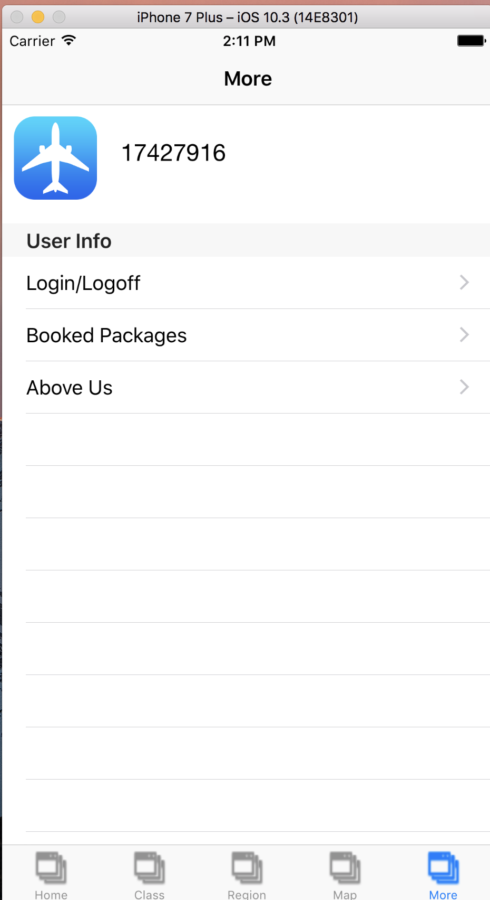
###LOGOUT
Once the Users have log in the system and log out the system any times.
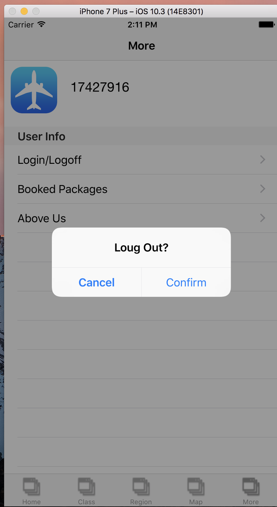
###MYPACKAGE
Once the Users login the system, he can show what he have brougth before. Btw, Only the web site can Cancel the Deals.
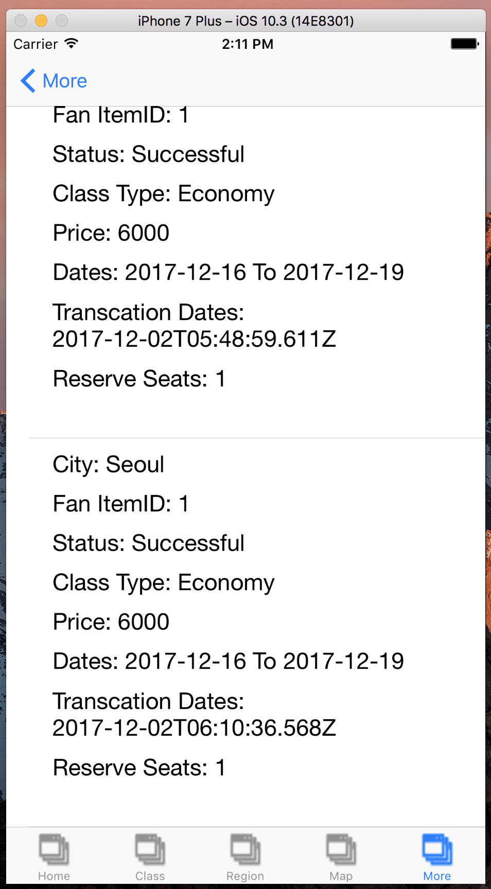
